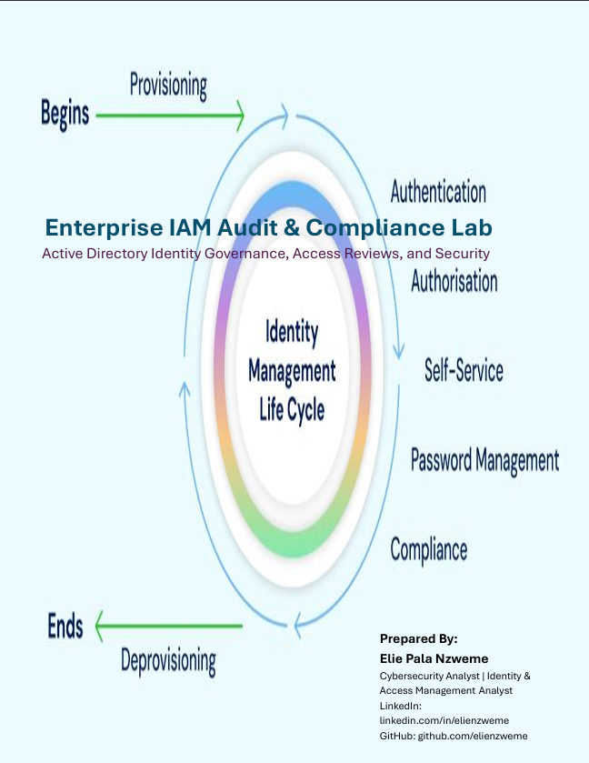
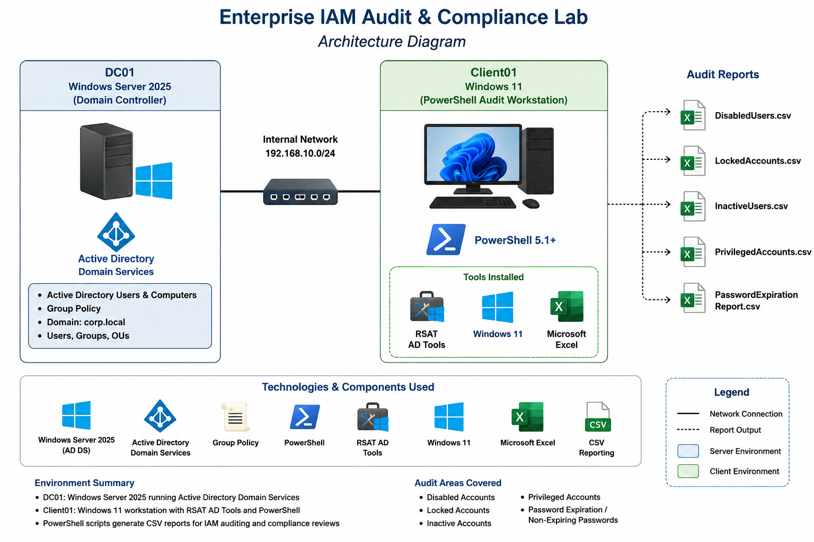
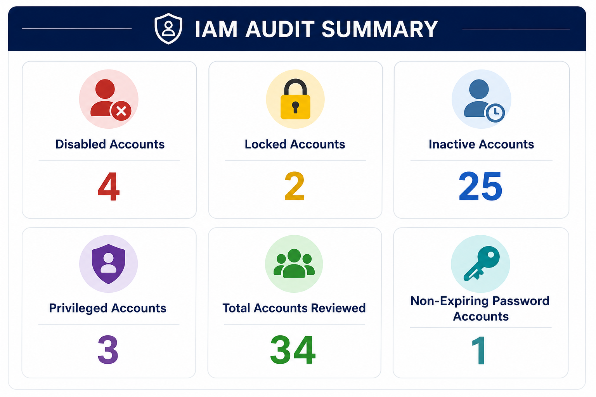
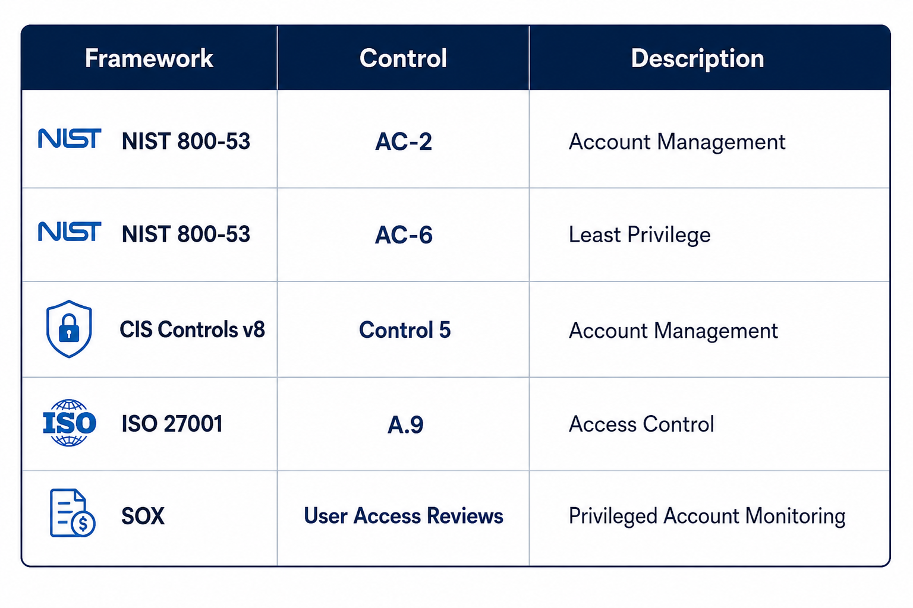
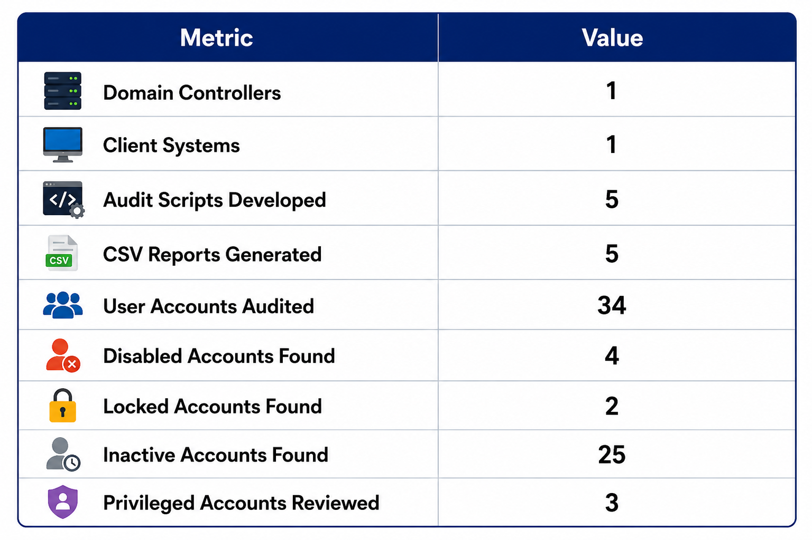
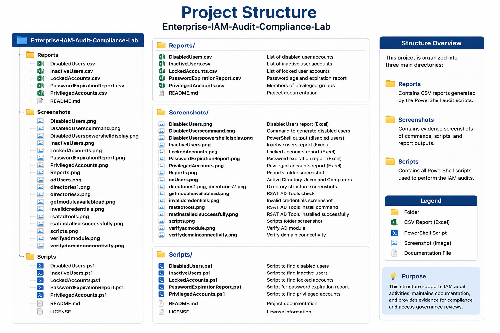

# Enterprise-IAM-Audit-Compliance-Lab

Active Directory IAM audit lab leveraging PowerShell automation to identify inactive, disabled, locked, privileged, and password-risk accounts while generating compliance-ready CSV reports.
---

# Cover Page

  

---

# Overview

This project demonstrates the implementation of an enterprise Identity and Access Management (IAM) audit and compliance program using Microsoft Active Directory and PowerShell automation.

The lab simulates real-world IAM analyst responsibilities including account governance, access reviews, privileged access management, password auditing, and compliance reporting.

The project focuses on:

- Identity Governance
- Account Lifecycle Management
- Access Reviews
- Privileged Access Management (PAM)
- Compliance Reporting
- Active Directory Administration
- PowerShell Automation

---

# Technologies Used

## Identity & Access Management

- Microsoft Active Directory
- Active Directory Domain Services (AD DS)
- RSAT Tools
- Group Policy

## Operating Systems

- Windows Server 2025
- Windows 11

## Scripting & Automation

- PowerShell
- Active Directory Module

## Reporting

- CSV Reporting
- Microsoft Excel

---

# Documentation

## 📄 Project Report

  

---

## Architecture Diagram

---

## Audit Categories

---

## Compliance Mapping

---

## Project Metrics

---

## Project Structure

---

# Lab Environment

| System | Role |
|----------|----------|
| DC01 | Active Directory Domain Controller |
| Client01 | PowerShell Audit Workstation |
| RSAT | Active Directory Administration Tools |
| Microsoft Excel | Audit Report Analysis |

---

# PowerShell Audit Scripts

## Disabled Users Audit

**Script**

[DisabledUsers.ps1](Scripts/DisabledUsers.ps1)

**Purpose**

Identifies disabled Active Directory user accounts.

---

## Locked Accounts Audit

**Script**

[LockedAccounts.ps1](Scripts/LockedAccounts.ps1)

**Purpose**

Identifies currently locked Active Directory accounts.

---

## Inactive Users Audit

**Script**

[InactiveUsers.ps1](Scripts/InactiveUsers.ps1)

**Purpose**

Identifies inactive user accounts based on logon history.

---

## Privileged Accounts Audit

**Script**

[PrivilegedAccounts.ps1](Scripts/PrivilegedAccounts.ps1)

**Purpose**

Identifies members of privileged Active Directory groups.

---

## Password Expiration Audit

**Script**

[PasswordExpirationReport.ps1](Scripts/PasswordExpirationReport.ps1)

**Purpose**

Audits password lifecycle information and non-expiring passwords.

---

# Generated Reports

| Report | Description |
|----------|----------|
| [DisabledUsers.csv](Reports/DisabledUsers.csv) | Disabled account report |
| [LockedAccounts.csv](Reports/LockedAccounts.csv) | Locked account report |
| [InactiveUsers.csv](Reports/InactiveUsers.csv) | Inactive account report |
| [PrivilegedAccounts.csv](Reports/PrivilegedAccounts.csv) | Privileged access review |
| [PasswordExpirationReport.csv](Reports/PasswordExpirationReport.csv) | Password audit report |

---

# Screenshots

## Environment Setup

| Screenshot |
|------------|
| [Active Directory Users](Screenshots/adUsers.png) |
| [Directory Structure 1](Screenshots/directories1.png) |
| [Directory Structure 2](Screenshots/directories2.png) |
| [RSAT Tools Installed](Screenshots/rsattools.png) |
| [RSAT Installation Success](Screenshots/rsatinstalled%20successfully.png) |
| [Verify AD Module](Screenshots/verifyadmodule.png) |
| [Verify Domain Connectivity](Screenshots/verifydomainconnectivity.png) |

---

## Script Execution

| Screenshot |
|------------|
| [Disabled Users Script](Screenshots/DisabledUserscommand.png) |
| [Disabled Users Output](Screenshots/DisabledUserspowershelldisplay.png) |
| [Inactive Users Output](Screenshots/InactiveUsers.png) |
| [Locked Accounts Output](Screenshots/LockedAccounts.png) |
| [Privileged Accounts Output](Screenshots/PrivilegedAccounts.png) |
| [Password Expiration Output](Screenshots/PasswordExpirationReport.png) |

---

# Audit Findings Summary

| Category | Findings |
|------------|------------|
| Disabled Accounts | 4 |
| Locked Accounts | 2 |
| Inactive Accounts | 25 |
| Privileged Accounts | 3 |
| Total Accounts Reviewed | 34 |
| Non-Expiring Password Accounts | 1 |

---

# Compliance Mapping

| Framework | Control | Description |
|------------|------------|------------|
| NIST 800-53 | AC-2 | Account Management |
| NIST 800-53 | AC-6 | Least Privilege |
| CIS Controls v8 | Control 5 | Account Management |
| ISO 27001 | A.9 | Access Control |
| SOX | User Access Reviews | Privileged Account Monitoring |

---

# Key IAM Controls Demonstrated

- User Lifecycle Management
- Account Governance
- Access Reviews
- Privileged Access Management
- Password Lifecycle Auditing
- Account Lockout Monitoring
- Security Reporting
- Compliance Validation
- Active Directory Administration
- PowerShell Automation

---

# Skills Demonstrated

### Identity & Access Management

- Active Directory Administration
- Identity Governance
- Access Reviews
- User Lifecycle Management
- Privileged Access Reviews

### Security Operations

- Security Auditing
- Compliance Reporting
- Risk Identification
- Access Governance

### Automation

- PowerShell Scripting
- CSV Reporting
- Active Directory Automation

---

# Security Recommendations

1. Review inactive accounts older than 90 days.
2. Investigate account lockouts.
3. Conduct quarterly privileged access reviews.
4. Review non-expiring password accounts.
5. Maintain recurring IAM compliance audits.

---

# Business Value

This project demonstrates how organizations can:

- Improve Identity Governance
- Reduce Unauthorized Access Risks
- Support Compliance Audits
- Enforce Least Privilege
- Automate Access Reviews
- Strengthen Active Directory Security

---

# Author

**Elie Pala Nzweme**

June 2026

Cybersecurity Analyst | Identity & Access Management

- LinkedIn: https://www.linkedin.com/in/elienzweme
- GitHub: https://github.com/elienzweme

---
## Disclaimer

This project was conducted in a controlled lab environment for educational and portfolio purposes only. All systems were owned or authorized for testing. The techniques demonstrated should only be used against systems for which explicit authorization has been obtained.

---

## License

This project is licensed under the MIT License. See the [LICENSE](LICENSE) file for details.
